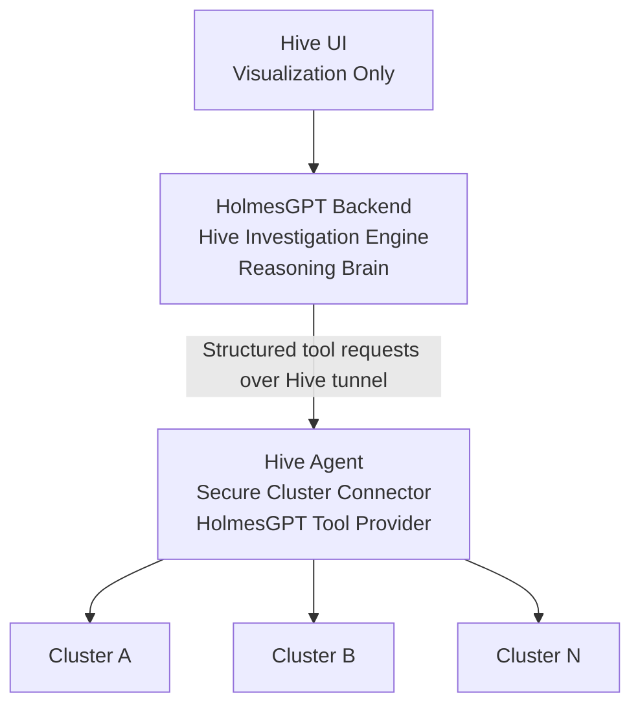
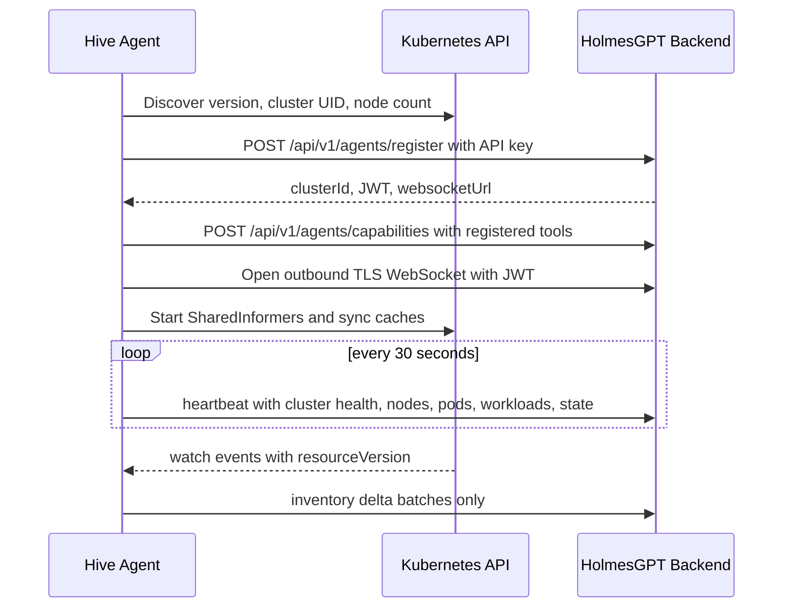

# Hive Agent

Hive Agent is a lightweight outbound-only **Secure Cluster Connector**. It connects one Kubernetes cluster to the Hive Control Plane using standard HTTPS/WebSocket egress and never runs HolmesGPT, local LLMs, or embedded AI workloads inside the customer cluster.

HolmesGPT runs in the Hive backend environment and is invoked by the Hive Control Plane investigation engine. The agent only provides read-only, allowlisted Kubernetes data access.

## Fixed UI installation flow

```bash
helm repo add hive https://charts.hive-sre.io
helm repo update
helm install hive-agent hive/hive-agent \
  --namespace holmes \
  --create-namespace \
  --set clusterName="my-production-cluster" \
  --set apiEndpoint="https://devportal.sha.go.ke" \
  --set apiKey="agt_xxxxxxxxx" \
  --set provider="aws"
```

Only `clusterName`, `apiEndpoint`, `apiKey`, and `provider` are required.

## Architecture




## Boot sequence



## HolmesGPT Backend provider contract

The repository includes `internal/holmesprovider`, a backend-side integration contract that exposes connected Hive Agents as HolmesGPT remote tools. The provider discovers registered agent capabilities, exposes tool definitions with JSON parameters, targets one cluster, cluster groups, or all clusters, dispatches commands in parallel, normalizes results, adds provider breakdown context, and emits audit records for every tool invocation.

## Command model

The Hive Backend must dispatch structured commands only:

```json
{
  "requestId": "uuid",
  "command": "get_crashloop_pods",
  "parameters": {"namespace": "*"}
}
```

Supported commands are:

* `get_pods`
* `get_pod`
* `describe_pod`
* `get_logs`
* `get_events`
* `get_nodes`
* `get_namespaces`
* `get_deployments`
* `get_statefulsets`
* `get_daemonsets`
* `get_services`
* `get_ingresses`
* `get_resource_usage`
* `get_cluster_health`
* `get_workload_health`
* `get_restart_analysis`
* `get_failed_workloads`
* `get_pending_pods`
* `get_crashloop_pods`
* `get_node_conditions`

Free-form prompts, shell execution, Kubernetes exec, port-forwarding, secret reads, writes, and arbitrary plugin execution are intentionally unsupported.

## HolmesGPT-compatible remote tool output

Hive Backend exposes these agent capabilities as an internal HolmesGPT tool layer. HolmesGPT selects tools, the Hive Backend dispatches to one or more cluster-scoped agents, and agents return structured JSON only:

```json
{
  "command": "get_failed_workloads",
  "clusterId": "cluster-uuid",
  "requestId": "request-uuid",
  "timestamp": "2026-01-01T00:00:00Z",
  "data": {"pods": [], "deployments": []},
  "status": "success",
  "durationMillis": 42
}
```

For multi-cluster investigations, each agent remains unaware of other clusters. The Hive Backend dispatches commands in parallel, aggregates all structured datasets, and sends the aggregate to HolmesGPT for reasoning and the final human-readable response.

## Registration payload

```json
{
  "clusterName": "my-production-cluster",
  "provider": "aws",
  "agentVersion": "1.0.0",
  "kubernetesVersion": "v1.31.0",
  "clusterUID": "xxxx",
  "nodeCount": 5,
  "apiKey": "agt_xxxxxx",
  "capabilities": ["get_pods", "get_pod", "describe_pod", "get_logs", "get_events", "get_nodes", "get_namespaces", "get_deployments", "get_statefulsets", "get_daemonsets", "get_services", "get_ingresses", "get_resource_usage", "get_cluster_health", "get_workload_health", "get_restart_analysis", "get_failed_workloads", "get_pending_pods", "get_crashloop_pods", "get_node_conditions"]
}
```

Registration response:

```json
{
  "clusterId": "uuid",
  "jwt": "token",
  "websocketUrl": "wss://backend/ws"
}
```

## Heartbeat payload

```json
{
  "clusterId": "uuid",
  "state": "ONLINE",
  "clusterHealth": "healthy",
  "nodes": {"ready": 12, "notReady": 0},
  "pods": {"running": 542, "pending": 3, "failed": 0},
  "workloads": {"deployments": 87, "statefulsets": 6, "daemonsets": 4},
  "timestamp": "2026-01-01T00:00:00Z"
}
```

## Inventory synchronization

Inventory uses Kubernetes `SharedInformers`, resourceVersion tracking, watch-based updates, and batched delta delivery to `/api/v1/agents/inventory/delta`. Full inventory resend is not part of the steady-state path.

## Security guarantees

* Outbound-only HTTPS/WebSocket connectivity.
* No Ingress, NodePort, or LoadBalancer.
* TLS 1.3 with certificate validation.
* API key is used only for bootstrap registration.
* JWT is used for authenticated runtime traffic and can be rotated live over the tunnel.
* Read-only RBAC for pods, logs, events, nodes, namespaces, deployments, replicasets, daemonsets, statefulsets, services, and ingresses.
* No secret access, no exec, no port-forward, no write verbs, and no serviceaccount token creation.
* No HolmesGPT, LLM runtime, or AI workload runs in the customer cluster.
